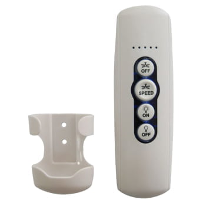

# RF Protocol for Star 7 celling fan's remote
### the rf protocol that the israeli company "star" uses for their celling fans



### I've recorded the whole functionality of star's remote and here what i decoded using URH ([Universal Radio Hacker](https://github.com/jopohl/urh)):
<br>
Modulation: ASK/OOK (Amplitude Shift Keying/ON-OFF Keying)
<br>
Frequency: 433.92M (common unlicensed frequency for garage remote/car remote/iot...)
<br>
carrier signal: 22k
<br>
symbol length: 1900 sps (at 4M sample rate)
<br>

``` py
Psuedo Protocol definition
Enum choice{
    ON      = 101101101100,
    OFF     = 100100100101,
    FAN3    = 100101101101,
    FAN2    = 101100101101,
    FAN1    = 100101101100,
    FAN-OFF = 100101101100,
    PAIR    = 100100101100
}
struct Command {
    bit[6] remote-serial;
    choice choice;
    byte Version;
}
# Example command: Turn On Light
# Command : 96d965b6db6db6cb6d8
# Serial: 96d965b6db6d
# Choice : b6c
# Version: b6d8
```
it is weirdly not 8 bit command size
<br>
## Vulnerabilities In This Protocol
### RF replay attack
the messages are static therfore a simple replay attack works just fine as long as you paired the serial
<br>
in theory you can just broadcast at high dBm the pair command and then <br>
any other command and all devices that are in signal range (including ones you don't own) will act upon command<br>
doing it is highly illegal

```
remote.py -s SERIAL -c COMMAND
serial - 12 hex valid serial
command that you want to use (PAIR,OFF,ON,FAN-X (x = 3,2,1),FAN-OFF)
```
### Demo video (remote.py):
https://github.com/user-attachments/assets/ab601ba2-17d4-462f-936e-2c2cabefd04a

